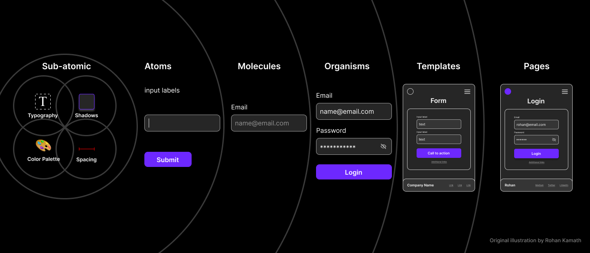

<h1 align="center">&nbsp;Props.to</h1>

<p align="center" style="margin-top: 20px">
  <p align="center">
  Open Source Feedback Platform
  <br>
    <a href="https://props.to"><strong>Learn more »</strong></a>
    <br />
    <br />
    <a href="https://props.to">Website</a>
    ·
    <a href="https://github.com/propsto/props.to/issues">Issues</a>
    ·
    <a href="https://github.com/propsto/props.to/milestones">Roadmap</a>
  </p>
</p>

<p align="center">
  
  <br/>
  <a href="https://docs.props.to" title="Proudly supported by GitBook">
  </a>
</p>

## About this project

Feedback throughout internet is a lost cause. Literally. No one knows which entity to trust. Whether you are a company, an internet figure, have social network presence or simply an employee, you can't own your feedback throughout all your public or private profiles. Until now.

Props.to is the go-to open source solution to own your feedback throughout all your connected profiles. Anyone could send you feedback even without your knowledge and then claim it by connecting your feedbacked profile to your account. Most importantly, you will be able to retain Props.to private feedback by your employer and choose to publish it in your Props.to public profile. You might change your job, but the feedback remains, allowing you to build more realistic and humane internet presence through Props.to.

## Getting Started

1. Install dependencies

```bash
pnpm install
```

1. Setup your local environment (local postgres using docker and prisma)

```bash
cp .env.example .env
pnpm dev:setup
```

3. Run the tests

```bash
pnpm test
```

4. Start the dev server for some application (web, auth, app)

```bash
pnpm dev:auth
```

5. Open the following URLs:
   1. http://localhost:3002 -> Auth app
   2. http://0.0.0.0:1080 -> Local email server
   3. http://localhost:5555 -> Prisma Studio (will be opened automatically)

---

## Atomic design

Leveraging [shadcn/ui](https://ui.shadcn.com/) elements and [Atomic Design](https://atomicdesign.bradfrost.com/chapter-2/), the `ui` package holds all the different elements to create anything in the UI.

Just as a reference, here is how we like Atomic Design to work within this project and how it is structured inside `packages/ui`. Note that sub-atomic particles are given by our Tailwind CSS configuration file at `packages/ui/tailwind.config.ts`.


<sub>Illustration by Rohan Kamath from his Atomic Design article <a href="https://blog.kamathrohan.com/atomic-design-methodology-for-building-design-systems-f912cf714f53">here</a>.</sub>
